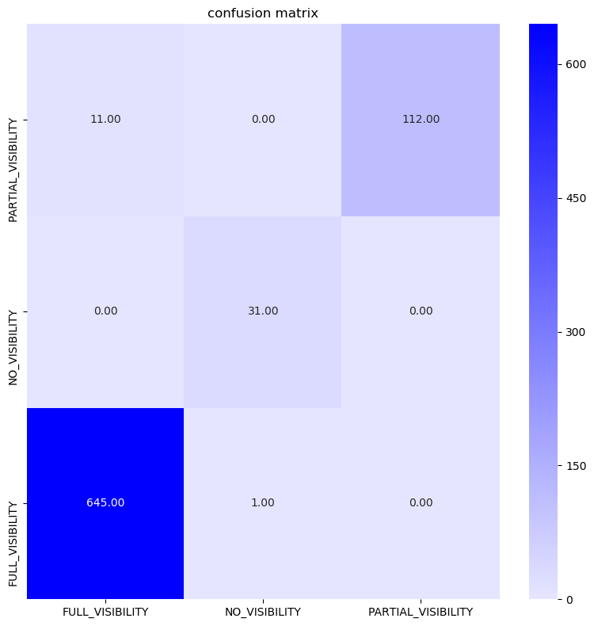

***


# Classifying the visibility of ID cards in photos

The folder images inside data contains several different types of ID documents taken in different conditions and backgrounds. The goal is to use the images stored in this folder and to design an algorithm that identifies the visibility of the card on the photo (FULL_VISIBILITY, PARTIAL_VISIBILITY, NO_VISIBILITY).

## Data

Inside the data folder you can find the following:

### 1) Folder images
A folder containing the challenge images.

### 2) gicsd_labels.csv
A CSV file mapping each challenge image with its correct label.
 - **IMAGE_FILENAME**: The filename of each image.
 - **LABEL**: The label of each image, which can be one of these values: FULL_VISIBILITY, PARTIAL_VISIBILITY or NO_VISIBILITY. 


## Requirements
Code is written with python 3 and to use the code, you need to first install the following python packages:

```Shell
pip install notebook
pip install numpy
pip install pandas
pip install opencv-python
pip install pytorch
pip install matplotlib
pip install seaborn
```

 
## Run Instructions

I'm recomending using [miniconda](https://docs.conda.io/en/latest/miniconda.html) for python enviroment and installig all the dependencies with the help of conda. Generaly will give a stable development enviroment

All the codes are in the code folder. In it with the help of main.py training and predicting can be done;
 - ```main.py -train``` will start training with default values
 - ```main.py -predict ../data/image/[image_name].png``` will predict and show the result.
 - ```main.py -predict_all``` will predict all the data in the dataset and generate a confusion matrix
 
     additinally some paramters like -cuda, -batch, epoch etc added for ease of use.

All the notebooks are located in notebook folder there are 4 different notebooks;

 - [1. Discovering the data]("notebooks/1. Discovering the data.ipynb") I inspect the data
 - [2. Input generation]("notebooks/2. Input generation.ipynb") Basic imput loading dataset generation part
 - [3. Model Selection]("notebooks/3. Model Selection.ipynb") How did I choose the model?
 - [4. Training splits and Training data]("notebooks/4. Training splits and Training data.ipynb") How did I generate the training splits? and Data augmentation

Some of the codes in the code folder are differ from the notebook versions because of keeping the notebooks clearer.

## Approach

After inspecting the data, I saw that the data is imbalanced and not so much in number thus, data augmentation is needed and spliting train, test, validation sets needed more care.
I wanted to use a deep learning method to solve the problem as it's my stronger point thus, I choosed [MobileNet_V2](https://arxiv.org/abs/1801.04381) from pytorch's pretrained models to use it as feature extractor with some minor changes. After that feature extractor, with the help of MLP classifier network predictions are generated. Model's regulation layers ,which are dropout and Batch normalizaion, are excluded from the notebooks to keep notebook easier to understand.

In training, f1 score and cross entropy loss are used for determining how good the model's training.

***Resulted confusion matrix***



## Future Work

 * In this work, the feature network is used with fixed weigths some of the later layer can be opened to fine-tuning to make the classification a bit specific to the dataset.
 * Comparision of the model is needed with some other models like conventional models or similar with smaller complexities to decide the efficiency of the model.
 * Parameter optimization of the model can give a bit more gain.
